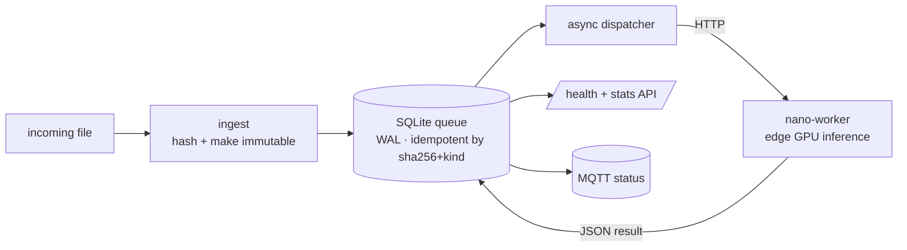

# perception-orchestrator

-003B57?logo=sqlite&logoColor=white)

A small image-perception pipeline. A coordinator service ingests files, turns
them into idempotent jobs, dispatches them to a GPU worker on an edge device,
persists the JSON results, and reports status over MQTT.

## What it does
- **Ingest**: hashes an incoming file, makes the original immutable, enqueues a
  job
- **Queue**: a single-writer SQLite queue in WAL mode, idempotent over
  `(sha256, kind)`, so re-ingesting the same file reuses the finished result
- **Dispatch**: an async loop hands jobs to a small inference worker over HTTP
- **Report**: job state is exposed via a health and stats API and published to
  MQTT

## Two halves
- `app/`: the coordinator (FastAPI) with the dispatcher loop, SQLite queue, inbox
  hashing, an HTTP client to the worker, and auth plus MQTT scaffolding
- `nano-worker/`: the edge inference service, a minimal FastAPI exposing
  `/health`, `/models`, `/analyze/image`, plus a systemd unit and installer for
  deploying it onto a small GPU board

## Design notes
Deliberately conservative: an idempotent queue (a crashed run never
double-processes), immutable originals, and the whole stack ships behind a
compose profile so it never starts by accident before the hardware is ready.

## Stack
- **Python**, FastAPI, httpx, SQLite (WAL), MQTT
- **systemd** for the edge worker, **hardened container** for the coordinator

MIT licensed.

## About this snapshot

This repository is a curated, secret-free extract from a private source repository.
A script performs the extraction: it drops non-public files, rewrites internal
addresses and paths to placeholders, and requires two independent secret scanners
to pass before anything is pushed.

The development history stays private, which is why you see a single commit here
instead of the real timeline. The code itself is not a demo: it runs in my own
infrastructure and is maintained there.
