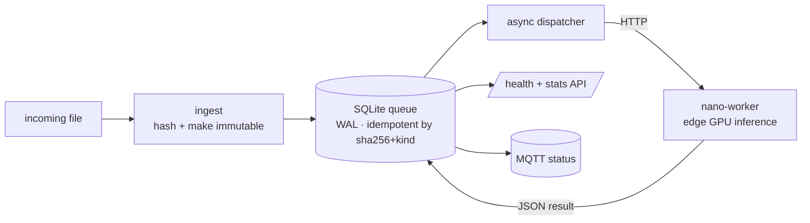

# perception-orchestrator

-003B57?logo=sqlite&logoColor=white)

A small image-perception pipeline. A coordinator service ingests files, turns
them into idempotent jobs, dispatches them to a GPU worker on an edge device,
persists the JSON results, and reports status over MQTT.

## What it does
- **Ingest**: hashes an incoming file, makes the original immutable, enqueues a
  job
- **Queue**: a single-writer SQLite queue in WAL mode, idempotent over
  `(sha256, kind)`, so re-ingesting the same file reuses the finished result
- **Dispatch**: an async loop hands jobs to a small inference worker over HTTP
- **Report**: job state is exposed via a health and stats API and published to
  MQTT

## Two halves
- `app/`: the coordinator (FastAPI) with the dispatcher loop, SQLite queue, inbox
  hashing, an HTTP client to the worker, and auth plus MQTT scaffolding
- `nano-worker/`: the edge inference service, a minimal FastAPI exposing
  `/health`, `/models`, `/analyze/image`, plus a systemd unit and installer for
  deploying it onto a small GPU board

## Design notes
The queue is idempotent, so a run that crashes halfway never processes the same
file twice. Originals are made immutable at ingest. The whole stack sits behind a
compose profile, which keeps it from starting before the hardware is there.

## Stack
- **Python**, FastAPI, httpx, SQLite (WAL), MQTT
- **systemd** for the edge worker, **hardened container** for the coordinator

MIT licensed.

## About this snapshot

What came out of this one were the worker's address, the inbox paths and the
model configuration. The rest went through the usual pass: internal addresses to
placeholders, two secret scanners, push blocked if either complains.

The history stays private, so there is a single commit. One honest caveat, unlike
the other repos here: the coordinator sits behind a compose profile and gets
started for a batch rather than staying up. The edge worker underneath it is a
different story, and the more interesting one: it is up, it answers with its model
loaded on the GPU, and these days it mostly serves a caller that is not this
coordinator at all. A document scanner sends it photographs. A component that
outlives the use case it was built for is usually a sign the interface was drawn
in the right place.
